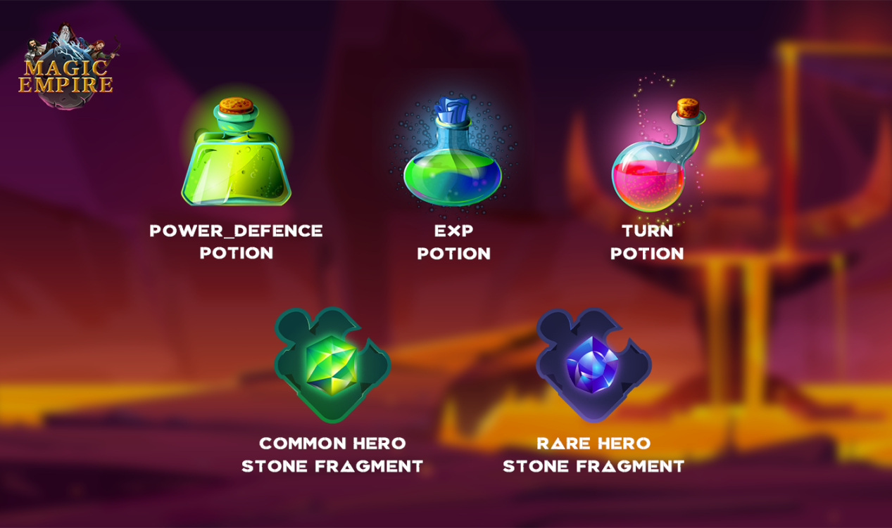
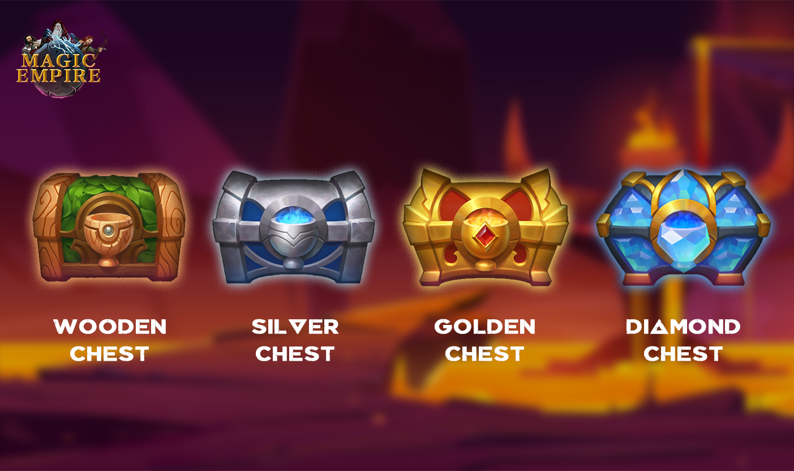
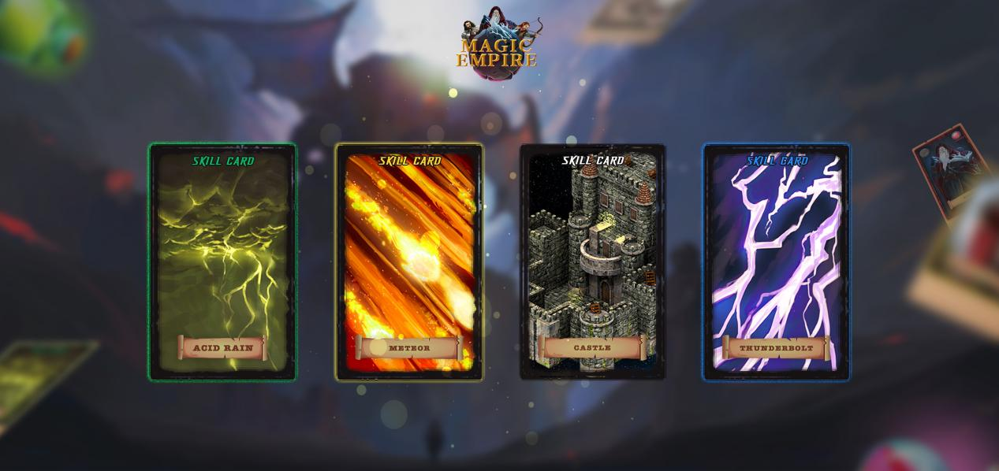

##### There are four bonus treasure chests: ***\*wooden treasure chest, silver treasure chest, golden treasure chest, diamond treasure chest\****.

------

Four treasure chests can produce five different items: ***\*Common hero stone fragments、Rare hero stone fragments、 Strength\Defense Potion、 EXP Potion、 TURN Potion.\****

 

Different treasure chests have different probabilities for opening items:

 

|                                | **RATE**                         |                             |                |                 |      |      |
| ------------------------------ | -------------------------------- | --------------------------- | -------------- | --------------- | ---- | ---- |
| **Common Hero Stone Fragment** | **Rare Hero** **Stone Fragment** | **Strength\Defense Potion** | **EXP Potion** | **TURN Potion** |      |      |
| **CHEST**                      | **Wood**                         | 20%                         | 11%            | 23%             | 23%  | 23%  |
| **Silver**                     | 25%                              | 15%                         | 20%            | 20%             | 20%  |      |
| **Golden**                     | 30%                              | 19%                         | 17%            | 17%             | 17%  |      |
| **Diamond**                    | 35%                              | 23%                         | 14%            | 14%             | 14%  |      |

 

------

Different hero stones have different probabilities for synthesizing different card rarities:

 

|                    | **RATE**       |                             |                |                 |      |      |
| ------------------ | -------------- | --------------------------- | -------------- | --------------- | ---- | ---- |
| **Rare Hero Card** | **Skill Card** | **Strength\Defense Potion** | **EXP Potion** | **TURN Potion** |      |      |
| **HERO STONE**     | **Common**     | 20%                         | 5%             | 25%             | 25%  | 25%  |
| **Rare**           | 23%            | 8%                          | 23%            | 23%             | 23%  |      |

 

