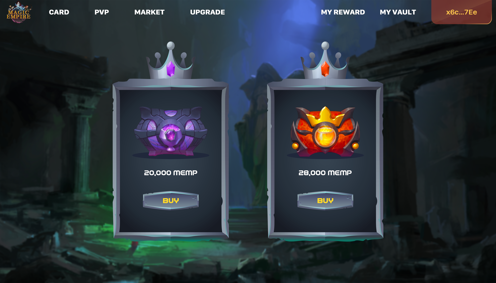

**Magic chest**-Randomly give the rarity index of TURN from 1 to 12

**Humanity chest**-Randomly give the rarity index of TURN from 1 to 12

------

 

Players can use $MEMP tokens to purchase two types of chests (magic chests and human chests) to obtain cards. Then, the user will randomly receive cards with different POWER, DEFENCE, TURN, BONUS REWARD and RARITY by opening the chest.

------

 Note: 1 treasure chest corresponds to 1 card, and turn corresponds to the maximum number of rounds for each card in a day.

------

 

The following table shows the attribute value range of cards with different rarities：

 

| RARITYATTRIBUTE | POWER  | DEFENCE | LEVEL | EXP  | TURN | BONUSREWARD |
| --------------- | ------ | ------- | ----- | ---- | ---- | ----------- |
| COMMON          | 1-30   | 1-30    | 1-10  | 0-99 | 1-4  | 0-5%        |
| EPIC            | 31-60  | 31-60   | 1-10  | 0-99 | 5-8  | 0-10%       |
| LEGENDARY       | 61-100 | 61-100  | 1-10  | 0-99 | 9-12 | 0-20%       |

